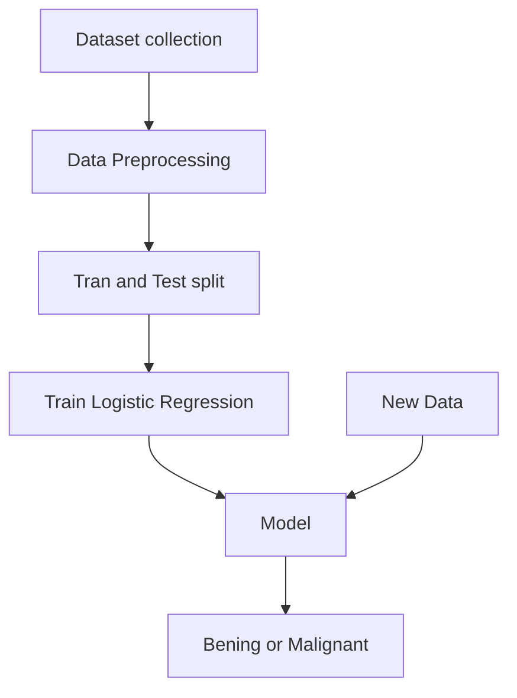

# Breast_cancer_ml_project

Here we are going to predict  whether the tumor is cancerous or not.

### What is a tumor?

A tumor is a mass or group of abnormal cells that form in the body. 

## First lets look at types of tumors:

  

BENIGN TUMOR                                               |      MALIGNANT TUMOR                           |
|-------------------------------------------------              |------------------------------------------------|                                               
|  1) Non cancerous                                             |   1) Cancerous                                              |
|  2)Capsulated                                                 |   2)Non Capsulated                                             |
|  3)Non invasive                                               |   3) Abnormal shape                                              |
|  4)Slow growing                                               |   4) Fast Growing
|  5)do not metastasize[Spread to other parts of the body]      |   5) Metastasize                                 |
|  6) Cells are normal                                            | 6) Cells have large and dark nuclei                                               |

## Work flow:

